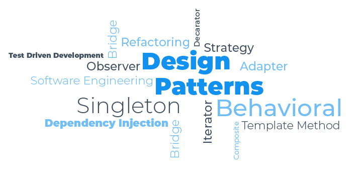

<div class="text-center">
    
</div>

## Why Reinvent the Wheel?

Imagine you’re an architect on your first day at work, excited to finally put your years of training to use. But then, your boss gives you a daunting challenge: design and construct a skyscraper without using any blueprints. To anyone with common sense, this task sounds absurd, right?

Software development without design patterns is no different. These patterns are the blueprints for solving common problems, allowing developers to build systems that are efficient, reliable, and scalable. Just like a well-designed skyscraper, great software relies on a strong foundation built off of design patterns.

## Building Smarter, Not Harder

I’ve had the opportunity to work on various website design assignments, and one of the most valuable lessons I’ve learned is the importance of reusable components. Learning React was particularly eye-opening because of its component-based architecture. A common analogy people use to explain components is that they’re like lego bricks, where you can piece together individual pieces to build an overall creation. I like to think of components as the building blocks of a user interface that capture individual pieces of functionality and can be reused throughout an application.

Take my team project titled, “[Musicians of Manoa](https://musicians-of-manoa.github.io/),” for example. This platform was created to connect individuals with a shared passion for music, allowing them to collaborate on jam sessions. To jumpstart the development process, my team and I used the [nextjs-application-template](https://ics-software-engineering.github.io/nextjs-application-template/), saving hours of time I’d otherwise spend setting up basic configurations. React templates, like the nextjs-application-template, are examples of the **Factory Design Pattern**, which is a design approach that provides an interface with pre-defined structures for efficient project setup.

However, design patterns extend beyond templates. They also include specific ways of structuring and solving problems within a project. 

## A Symphony of State Changes

One example from my Musicians of Manoa project was the **Observer Design Pattern**, which is particularly useful for handling state changes. Imagine the Observer Design Pattern as a conductor in an orchestra. When the conductor (the state) changes tempo, the entire orchestra (the components) adjusts in real-time. In this project, I was responsible for creating the Jam Information Form, which allowed users to create Jam sessions, and the subsequent Jam Information Cards, which allowed users to view information posted via the form. 

Here’s how it played out in our project: When a user submitted jam session details (e.g. jam name, image, organizer, genre, location, date & time, instrument(s), experience level, and description) it triggered changes across the application. The submission went through a React component called `JamInfoForm`, which then sent the data to a PostgreSQL database using the `addJamInformation` function:

```
export async function addJamInformation(jamInfo: {
  owner: string;
  jamName: string;
  image: string;
  organizer: string;
  genre: string;
  location: string;
  date: Date;
  instruments: string;
  experience: Experience;
  description: string;
}) {
  const parsedDate = new Date(jamInfo.date);
  if (Number.isNaN(parsedDate.getTime())) {
    throw new Error('Invalid date format.');
  }
  await prisma.jamInformation.create({
    data: {
      owner: jamInfo.owner,
      jamName: jamInfo.jamName,
      image: jamInfo.image,
      organizer: jamInfo.organizer,
      genre: jamInfo.genre,
      location: jamInfo.location,
      date: parsedDate,
      instruments: jamInfo.instruments,
      experience: jamInfo.experience,
      description: jamInfo.description,
    },
  });
  redirect('/search/jam-search');
}
```

On the user interface side, the `JamInfoForm` component invokes this function through an `onSubmit` event handler:

```
const onSubmit = async (data: {
  owner: string;
  jamName: string;
  image: string;
  organizer: string;
  genre: string;
  location: string;
  date: Date;
  instruments: string;
  experience: Experience;
  description: string;
}) => {
  await addJamInformation(data);
  swal('Success', 'Your Jam has been added', 'success', {
    timer: 2000,
  });
};
```
Once this form is submitted, the database updates, and the UI automatically reflects the changes by generating a new Jam Information Card. This sequence showcases the Observer pattern in action and how a change in one part of the system triggers updates in others, which ensures a dynamic user experience.

## Blueprints for Success

In conclusion, design patterns are not only just tools, but the foundation for creating robust, maintainable, and efficient software. By giving us reusable blueprints for common problems, they let software developers and engineers focus on what really matters—bringing ideas to life. From the reusable components of React to the Observer Design Pattern’s real-time updates, my experiences in ICS 314 showed me how design patterns transform ideas into reality. Just like architects rely on blueprints to construct skyscrapers, developers rely on design patterns to create stable and efficient software.
