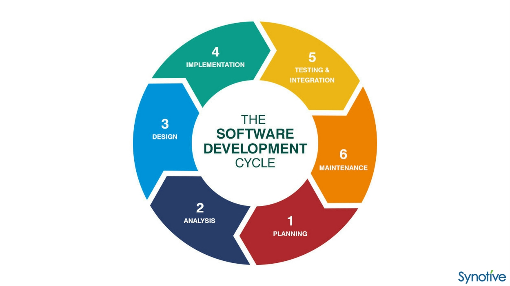

  

## Tracking Method: Effort Estimates
Throughout the development of our "Musicians of Manoa" ICS 314 final project, each team member tracked their progress by logging the estimated time versus the actual time (for both coding and non-coding efforts). When estimating my effort, I based the times on how long similar tasks took me in previous assignments, such as “Bowfolios” and “Digits.” I also used the screencasts for each respective assignment as a rough reference for estimating how long each issue would take.

## The Benefits of Tracking Your Efforts
For the most part, I tended to underestimate my effort, with the actual time to complete both coding and non-coding tasks taking much longer. Especially at the beginning of the project, I spent a lot of time familiarizing myself with Next.js, React, and PostgreSQL, and understanding how these tools interacted to create a fully functional web application. Because I had to overcome the initial learning curve with these new development tools, my process started off slow and tedious. Even though I frequently referenced the screencasts, they were typically used as a general guide, as my team wanted to implement new features that went beyond what the screencasts covered. For example, when creating the “Jam Information Page,” our validationSchemas.ts file included different data from what was shown in the screencasts. These small differences made the learning curve even steeper. However, as I became more comfortable with using Next.js, React, and PostgreSQL, my effort estimates became more accurate.

In hindsight, making effort estimates in advance made the task feel less daunting, as it allowed me to visualize roughly how long it would take to complete. It also improved my time management skills. Once I set an expectation for how long a task should take, I worked as efficiently as possible to try to complete the task within the given time frame.

Tracking my actual effort expended on the issues was beneficial because it gave me insight into how long it actually took me to complete tasks. It helped me understand how time-consuming different tasks were, depending on the amount of work involved (e.g., connecting a component to the database versus refining UI changes). I see myself using this method of tracking in the future to stay more organized when working on new projects.

## Tracking Method: Actual Effort
To track my actual effort, I typically used a timer on my computer. I also sometimes logged the start and end times of each task (e.g., “Start time: 7:30 PM, End time: 9:30 PM”). I believe these methods of tracking were fairly accurate, though they didn’t account for discrepancies, such as when I took small breaks between completing parts of an issue.
