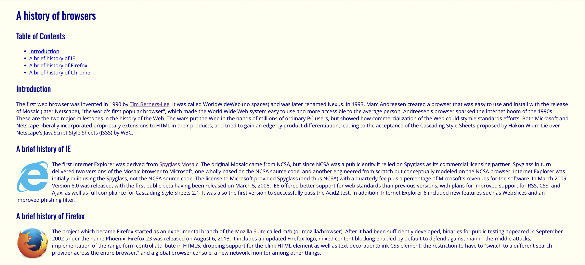
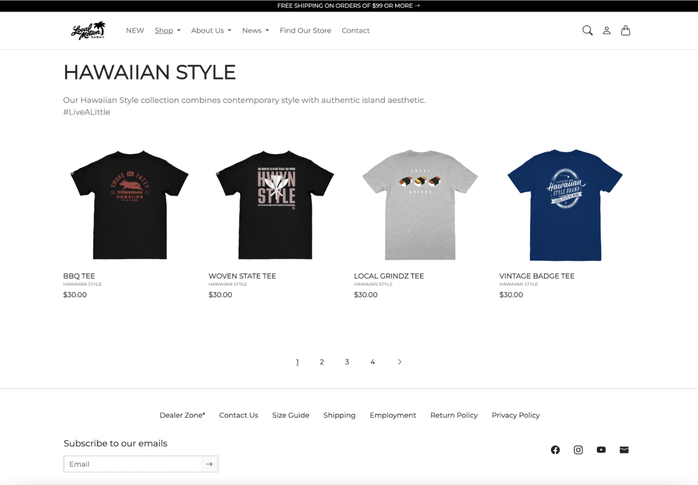

## Cass and Bostrap’s Pizza Fiasco

Imagine being tasked with making pizza for a family dinner. Person A, let’s call her Cass, decides to make the pizza completely from scratch. Cass determinately hand-makes the dough, kneads it to perfection, crushes garden-grown tomatoes into a velvety sauce, grates some homemade cheese, tops the pizza with homemade pepperoni, and pops the wonderful, cheesy creation into the oven. After 5 hours of endless work, Cass looks over at the clock and is pleased to see that it’s 5:30 pm— just in time for the 6:00 pm dinner. 

Person B, let’s call him Bostrap, walks into the kitchen and— without a single word exchanged— takes out a pre-made frozen pizza from the refrigerator and pops it into the oven. Cass can’t help but be furious. All that work just for Bostrap to swoop in at the last minute and do not even a fraction of the work that she just spent 5 hours on? Not fair. 

Okay, enough pizza talk. Let’s get into how this relates to software engineering.

## Handcrafted Code or Pre-made Frameworks?

In this pizza analogy, Cass represents CSS and Bostrap represents Bootstrap 5 (See what I did with the names?). While Cass gets some brownie points for creating the pizza entirely from scratch, it also took 200% more effort compared to Bostrap. (Of course, you could argue that Cass’s pizza was worth the effort because the homemade pizza likely tasted better than the store-bought pizza, but that’s not the point of the analogy.) The main takeaway here is to notice how easy it was for Bostrap to complete the task of making pizza for the family dinner since he already had pre-made pizza at hand.

The beauty of UI frameworks like Bootstrap 5 is that they help front-end developers create functioning and responsive websites quickly and efficiently. Bootstrap 5 provides templates for HTML, CSS, and Javascript-based code on design elements such as input forms, buttons, navigation bars, and much more. This ease of implementation helps tremendously cut down the time it would take to build a website with raw CSS. It also ensures that developers have all the essential components inputted so they can focus their attention on more trivial things, such as the content and functionality of the site itself. However, Bootstrap has a steeper learning curve, so getting comfortable with the built-in features and syntax took longer than I’d like to admit. 

That being said, why even bother to learn raw HTML and CSS if frameworks like Bootstrap 5 exist? Both CSS and Bootstrap each serve their individual purposes. Depending on the type of website you want to make or the task at hand, using raw CSS might still be necessary. Bootstrap 5 provides a wide selection of pre-made components, but sometimes you need more control or customization than what a framework offers. In my experience working with Bootstrap 5, I found that while it gave me a head start on building responsive layouts, there were moments when I needed to custom-write CSS to get the exact look that I wanted. For example, to get more practice using Bootstrap 5 for my ICS 314: Software Engineering I course, we were tasked to replicate a website for a popular local restaurant and bar called <a href="https://www.murphyshawaii.com/">Murphy’s Bar and Grill</a>. To my luck, Bootstrap 5 already contained many pre-made components, such as the navigation bar and footer. However, to customize the footer with the exact shade of green as the official website, I had to customize it using CSS. 

  

## Frameworks Make Coding a Pizza Cake

To further hone down the differences between using raw HTML and CSS versus Bootstrap 5, let’s take a look at these two examples:

  
  

On the left is a simple website created entirely with raw HTML and CSS. As you can see, while the website serves its purpose, the design is not the most aesthetically pleasing. On the right, I recreated a version of the <a href="https://www.localmotionhawaii.com/collections/hawaiianstyle?page=1">Local Motion Hawaii</a> website using Bootstrap 5. The design is more polished and includes complex, responsive components like dropdown menus, a carousel for multiple pages, and an input form for emails. This example highlights how Bootstrap 5 makes it easier to implement advanced design features quickly, whereas CSS would require significantly more time and effort to achieve the same results. 

## Food for Thought

In the end, using UI frameworks like Bootstrap 5 is like choosing the convenience of pre-made pizza over the labor of making everything from scratch. Both methods have their advantages, and the best approach depends on the task at hand. While Bootstrap 5 allows for faster development and polished designs, having a solid understanding of HTML and CSS provides the flexibility to create customizable, unique websites. From my own experience, Bootstrap 5 saved me time and effort, but the need for customization reminded me of the importance of knowing the basics. 

