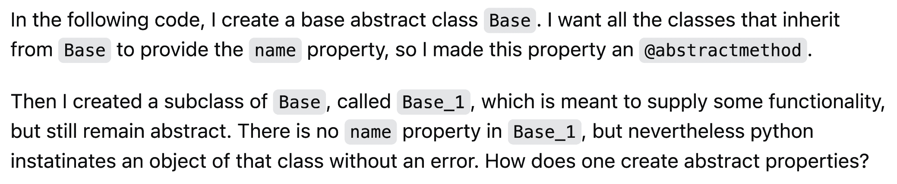
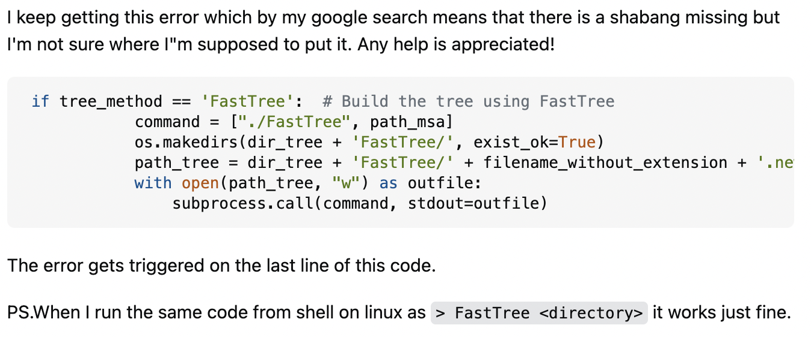

    

*“The scientist is not a person who gives the right answers, he's one who asks the right questions.” ― Claude Levi-Strauss*

Humans are instinctively curious creatures. When we want to know more about something, we naturally ask about it. For software engineers, asking the right questions is crucial, as it can lead to effective solutions, especially if those questions are constructed correctly. In his essay “[How to Ask Questions the Smart Way](http://www.catb.org/esr/faqs/smart-questions.html),” Eric Raymond provides guidelines on how to formulate good questions in open-source online communities, such as Stack Overflow, to improve the likelihood of receiving well-written, helpful answers.

## Raymond’s Guide to Good vs. Bad Questions

Before diving into specific examples, it's important to understand what distinguishes a good question from a bad one. According to Raymond, smart questions are formulated with thoughtfulness and intention. Before asking a question, the asker should have already attempted to find the answer by searching through multiple sources. Only after exhausting all options should they turn to Stack Overflow. A smart question should have a specific subject header that clearly conveys the main issue. It must be precise and informative, without being overly lengthy, and should include details about the problem itself, rather than the asker's interpretations of what might be going wrong.

On the other hand, bad questions directly oppose these principles. While poorly worded, abrupt, or vague questions are problematic, the issue often goes deeper. Typically, when someone asks a bad question, they are unsure of the core problem and are seeking a quick fix by offloading their issue onto someone else, hoping that they will solve it for them. Unthoughtful queries tend to yield unthoughtful answers, resulting in little valuable information for the asker.

Now, let’s explore examples of what smart and not-so-smart questions look like.

## The Art of Smart Questions

Take a look at this question asked on Stack Overflow titled [“How to create abstract properties in Python abstract classes?"](https://stackoverflow.com/questions/5960337/how-to-create-abstract-properties-in-python-abstract-classes)

    

Right from the start, the user provides a clear explanation of the code they've written, their intended goal, and the steps they've taken so far. This background information is crucial, as it allows others to understand the context and offer precise, informed answers. The question itself is straightforward and encapsulates exactly what the user wants to know. This format aligns perfectly with the key values Raymond emphasizes, making it a smart question.

## Not-so-Smart questions

Now, let’s look at a less effective question titled [“OSError: [Errno 8] Exec format error: './FastTree' [duplicate]"](https://stackoverflow.com/questions/78971941/oserror-errno-8-exec-format-error-fasttree)

    

From the title alone, the reader is left uncertain about the exact problem, and the content of the question does little to clarify it. This lack of clarity violates Raymond’s guideline: “Use meaningful, specific subject headers.” The user mentions an error and a quick Google search but provides minimal background on what they’re trying to achieve. Furthermore, they show little effort in troubleshooting the problem beyond the initial search. This makes it challenging for others to understand the issue and offer help. The closing remark, “Any help is appreciated!”, while polite, falls into another of Raymond’s traps: the “semantically-null question,” which adds no value to the query.

## Reflections and Insights

Smart questions are critical in software engineering, not just because they lead to better answers, but also because they demonstrate a thoughtful approach to problem-solving. In the examples above, the smart question received detailed and helpful responses, as displayed by the 250+ upvotes it received. In contrast, the not-so-smart question was closed just two hours after I found it, reflecting the poor quality of the initial query. Asking a question takes time, and being able to form a smart question takes double the amount of effort and consideration. However, the benefits of well-considered questions extend beyond the asker and contribute to the broader community by creating productive exchanges and interactions for everyone.

