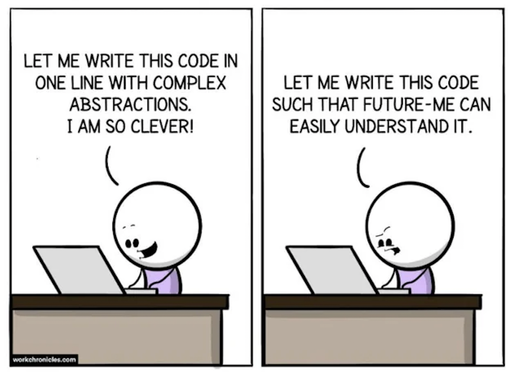

There’s a lot of scary things in the world—snakes, spiders, heights… oh, and missing semicolons. In the world of software engineering, developers follow a set of guidelines and coding practices known as “coding standards.” To some, these standards are either a gift from the programming gods or the bane of their existence. However, I find myself genuinely appreciating the nuances of formatting code in a particular way. As annoying as that red squiggly line can be, having a clear method of structuring code satisfies the (slightly obsessive) perfectionist in me and makes it easier for others to understand and work with my code.

## Why coding standards matter

Imagine a world where there was no order or structure to anything—no restrictions, no constraints, and no coding police to tell you that you're missing a bracket. While it sounds freeing at first, without structure comes chaos. Just like each writer has their own “voice,” every developer has their unique style for solving coding problems. With no coding standards, this diversity of styles would turn collaboration into a nightmare. Different people would solve problems in different ways, making it almost impossible to decipher what others have written. 

Coding standards provide a common language for developers. By ensuring that people adhere to a set of rules, they improve the readability for everyone. This means that you won’t have to be fighting with your colleague about trivial things like indentation styles or where to place brackets. Instead, everyone can focus on what truly matters: solving the problem at hand. When everyone is on the same page, it becomes easier to debug and extend the codebase without introducing unnecessary friction. Standards are not just for aesthetics; they’re a core part of writing clean, efficient code.

## Learning Through Coding Standards
In my experience, coding standards have actually helped me improve my understanding of JavaScript—especially through tools like ESLint (a tool that identifies and fixes JavaScript code). ESLint can be a tough critic, highlighting even the smallest details like an unused variable or a forgotten semicolon. At first, I found getting rid of all those ESLint errors annoying. It felt like I was being nitpicked to death. I was in a robotic rotation of “quick fix”-ing every red squiggly line in sight. But over time, I began to see how these "errors" weren't just arbitrary rules; they were teaching me how to write more consistent, reliable code.

For example, ESLint taught me the importance of properly scoping variables (thanks to its guidance, I now have a clearer understanding of when to use const versus let). Without a tool enforcing these standards, I might not have recognized potential bugs in my code. These rules forced me to rethink my approach, and in doing so, I learned better practices in JavaScript.

## Embracing the Red Squiggly Line

Ultimately, coding standards, while sometimes annoying, are a necessary part of the development process. They ensure that my code is not only functional, but maintainable in the long run. While the standards enforced by ESLint seemed tedious at first, they taught me valuable lessons on how to improve the quality of my code and made me realize that ESLint isn’t just nitpicking, but actually helping me become a better programmer. 

So, while I dread to see the red squiggly line at times, I've come to embrace it. Coding standards have helped me become a more disciplined and thoughtful programmer, and I believe they are an essential part of the software development process. 
