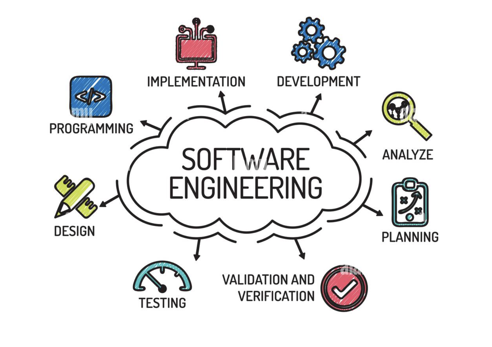

    

## Introduction
The world of software engineering is widespread, encompassing a diverse range of topics, from open source software development to design patterns. From my time in ICS 314: Software Engineering, I explored many of these concepts and how they contribute to the broader scope of software engineering. While this class focused a lot on web development, it opened my eyes to how expansive software engineering is, and how it can lead to multiple avenue sfor learning and career growth. Of all the topics we covered, the ones that resonated with me the most were **functional programming**, **user interface frameworks**, and **agile project management**.

## Functional Programming
Functional programming is a way of writing code that focuses on using functions to process and transform data. It’s all about writing cleaner, reusable, and predictable code, which I learned early on in the semester while working with TypeScript.

We started with functional programming constructs like map, reduce, and filter, which let us manipulate arrays in powerful ways. These tools brought together my experience with functions in Java and JavaScript while introducing me to something new. For example, the idea that functions could be passed around like data or returned by other functions was eye-opening. It felt like TypeScript gave functional programming a simplicity and clarity I hadn’t experienced in other languages like Java or Python. One of the most memorable ways I used these skills was during the "Musicians of Manoa" project. I used the map method to dynamically create and display Jam Information Cards, making sure each new card was neatly formatted and aligned. This helped me see how functional programming can make repetitive tasks simpler and cleaner.

Outside of web development, functional programming has so many uses. It’s great for data processing, machine learning, and even building scalable systems. It’s a concept I know I’ll revisit often in my future projects.

## User Interface Frameworks
User interface frameworks are tools that make designing websites faster and easier by providing pre-built components and layouts. They help ensure that websites look good, work well, and stay consistent across browsers.

When I first saw the ICS 314 course syllabus, I was excited about this topic because it directly relates to what I want to do in the future: UX/UI design. We learned to use Bootstrap 5, a popular CSS framework, and it made building websites so much simpler. Instead of writing custom styles for every element, Bootstrap gave me tools to quickly create responsive layouts and add professional-looking components. For example, in one project, I used Bootstrap’s card and grid systems to organize content cleanly. It saved so much time and made the interface look polished without a lot of extra effort. Since then, I’ve started using Bootstrap and React by default for my own projects because they make creating visually appealing and functional designs so much easier.

Learning about UI frameworks reinforced my love for design and showed me how these tools can help bridge the gap between developers and designers. They’re not just for web applications— they can be useful in prototyping, dashboards, and even mobile design. 

## Agile Project Management
Agile project management is all about flexibility and collaboration. It breaks big projects into smaller tasks that can be adjusted as things change, which is especially useful when working in teams.

In class, we focused on a specific style of Agile called Issue-Driven Project Management (IDPM). Using GitHub, my team and I divided our project into milestones, then broke those milestones into smaller, manageable issues. Each issue was assigned to someone and tracked, which kept everyone accountable and on the same page. One thing that really stood out was how important communication is in a team setting. At first, we ran into problems with our Prisma database because multiple people were making changes without telling each other. This caused errors and conflicts when we tried to merge our code. Once we started communicating better (like letting everyone know when changes were made) the process became much smoother.

Agile isn’t just for software projects. I could see myself using this approach in almost any collaborative setting, like planning events or managing research projects. It’s a great way to stay organized and adapt as new challenges come up.

## Reflection
In conclusion, this course has taught me so much more than just how to build web applications. It gave me a solid foundation in software engineering concepts and helped me see how they apply to all kinds of projects, not just coding. Whether it was learning about functional programming, mastering UI frameworks, or working collaboratively with Agile methods, I feel more confident about tackling future challenges. It was incredibly interesting to learn about all of these topics, and I will most definitely take advantage of what I learned from this course and apply my newfound knowledge to future projects moving forward.
