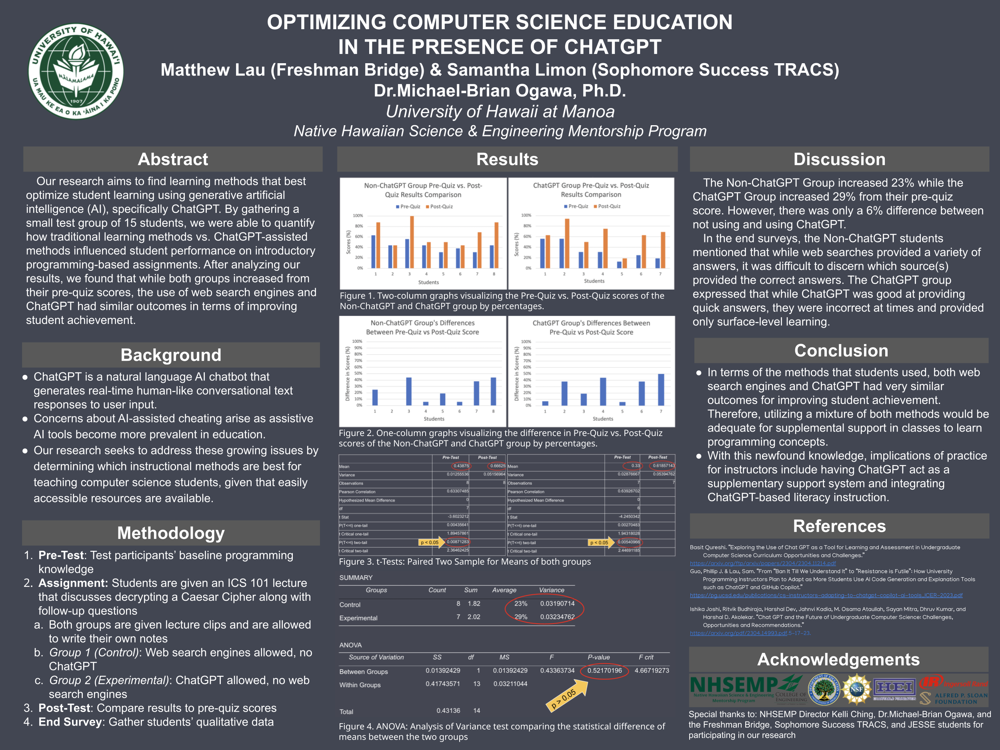

  

My project titled "Optimizing Computer Science Education in the Presence of ChatGPT" was for a research internship with the Native Hawaiian Science & Engineering Mentorship Program (NHSEMP) Program at the University of Hawaii at Manoa. This project was presented at a final research symposium at the end of my internship.

## Abstract
The goal of this research project was to find learning methods that best optimize student learning using generative artificial intelligence (AI), specifically ChatGPT. We focused on how generative AI tools influenced student learning and studied whether these tools can either maximize or minimize student performance within computer science education in comparison to traditional learning methods. By gathering a small test group of 15 students, we were able to quantify how traditional learning methods vs. ChatGPT-assisted methods influenced student performance on introductory programming-based assignments. After analyzing our results, we found that while both groups increased from their pre-quiz scores, the use of web search engines and ChatGPT had similar outcomes in terms of improving student learning.

## Methodology
The methodology for our research consisted of four main components: 1) Pre-Test, 2) Assignment, 3) Post-Test, and 4) End Survey. 

First, we gathered a total of 15 UH Manoa student to participate in this study. Most of our participant pool had little to no prior experience with programming, so we created a pre-test to test their baseline programming knowledge. The pre-test consisted of 12 multiple chice questions and 4 free response questions which covered an ICS 101 introduction to Python programming lecture that discussed how to solve a Caesar cipher mathematically through the use of fundamental coding concepts. 

Once they completed the pre-test, we gathered the results and split the group into two groups. Both groups were informed that they would take a post-test 1 week after taking the pre-test to see how much information they retained. To study for the post-test, both groups were given an assignment with additional lecture material to help them practice, prepare, and review. One group could study using ChatGPT, but could not use web search engines (such as Google) to assist them with the assignment. The second group were given more traditional methods, such as note-taking and watching lecture videos. This group was allowed to use web search engines, but could not use ChatGPT.

After 1 week, both groups were subjected to a post-test to determine whether they had improved from their previous pre-test score. The post-test questions were exactly the same as the pre-test questions. 

## My contribution
My role was a co-investigator for this research project, and I worked alongside my partner every step of the way. I also received guidance from my principal investigator (PI) throughout the duration of this study. I was responsible for every component of this project, which consisted of formulating and distributing the pre-test and post-test, creating assignments for both the ChatGPT and Non-ChatGPT test groups, creating the end-of-study survey, and performing data analysis on the results gathered.

# What did I learn?
This was my very first time co-leading a research study, and I learned a lot about the entire formal research process.
