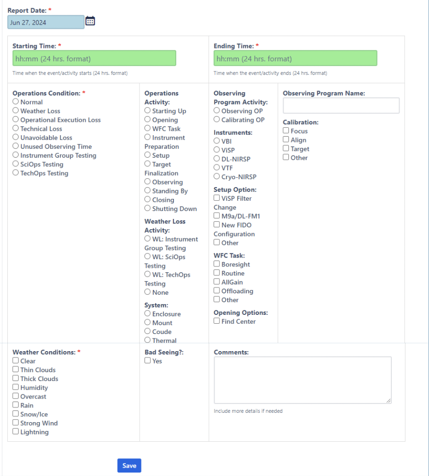
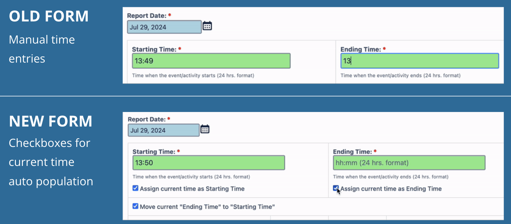

  

Over the summer of 2024, I interned at the Daniel K. Inouye Solar Telescope (DKIST) in Maui, Hawaii under the Akamai Workforce Initiative Program. My project is titled "Science Operations Specialist Group Daily Report Form Upgrade", which focused on developing a GUI prototype and automated message queue for DKIST's Daily Activity Report Form.

## Project Background & Significance
The National Solar Observatory’s Daniel K. Inouye Solar Telescope is dedicated to studying the sun's magnetic fields and dynamic behavior. These discoveries are all made possible with the help of the Science Operations Specialist (SOS) Group, who are responsible for operating DKIST and documenting hundreds of operations activities using the SOS Daily Activity Report Form. Although the current form is effective, it necessitates significant manual entries, posing efficiency challenges for the timely logging of observational data by the SOS Group.

## Project Summary
This project aims to ensure efficient logging of daytime solar activities and operations by upgrading the SOS Daily Report Form through two phases. The first phase focuses on developing a prototype toolkit and graphical user interface (GUI) for the next generation DKIST Daily Activity Report Form. The second phase focuses on auto-populating log information using an observing event message queue provided by DKIST’s high-level software group. Integration of this phase involves enabling communication between the GUI prototype and a DSSC machine using RabbitMQ, a message-queuing broker software. This process runs on Oracle VirtualBox using the Ubuntu Linux operating system and coded in Java.

## My Contribution
I was responsible for all aspects of the project from start to finish. However, throughout my project, I received guidance from my mentor, who works as a Science Operations Specialist at DKIST. I also worked with a DKIST High-Level Software Engineer, who helped me produce the automated message queue system using Java.

To start, I researched whether native or web-based applications were best for improving the form's current user interface. In the end, I settled on the web-based application, Confiforms for Atlassian Confluence. Since the existing Daily Report Form alreday resided on Confiforms, it would be easier to implement my GUI alterations. This also means my alterations wouldn't clash too much with the pre-existing Python code devleoped by one of the SOS Group members.

Next, I received feedback from the SOS Group to gather their thoughts, opinions, and concerns with the current Daily Report Form. I asked about what improvements they would like to see, what issues they run into, usability of UI navigation, and what features they would like more automated.

Using the SOS Group's feedback, I honed down on the most frequent concerns, which mainly addressed the manual time entries and time inconsistencies, and began developing my GUI prototype on Confiforms. In the previous form, start and end times for telescope observation activities were logged manually. To address this problem, I implemented checkboxes that automatically inputted the start times and end times in HST. A checkbox also moved the current end time to the start time to mark a new form submission.

  

