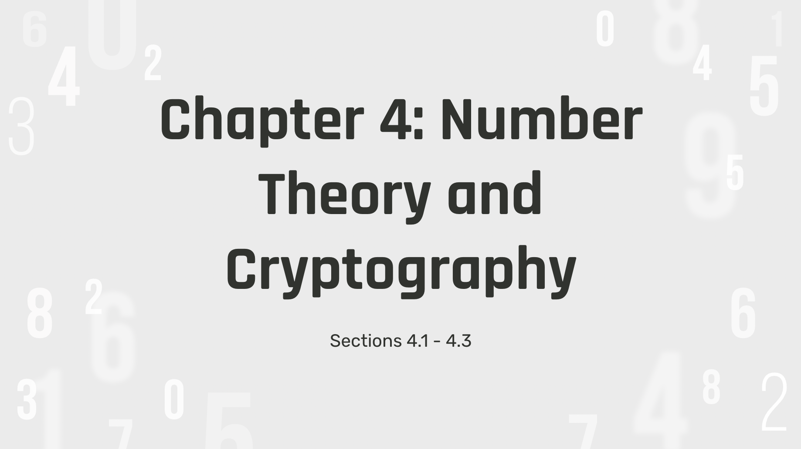

  

## Overview
During Spring 2024, I took course called ICS 390: "Computing Ethics for LAs", and I experienced what it was like to be a learning assistant for an ICS 111: "Introduction to Computer Science I". As part of the oral communication requirement, this course requires students to lead a recitation session for a week on a specific topic covered in lecture. The topic I decided to cover was on number theory and cryptography.

## Responsibilities
I had the responsibility of teaching this lesson to three ICS 111 sections. Sections 1 & 3 had around 60 students while section 2 was smaller and had around 20 students. To prepare for my week of teaching, I drafted a lesson plan/outline which included a task I wanted to complete within a specified time frame. My tasks for each recitation session were split into four parts: 1) Introduction, 2) Lesson presentation, 3) Group worksheet session, and 4) Worksheet review. I created and prepared a corresponding slides presentation, practice worksheet, and worksheet solutions document to facilitate my lecture. All of these components were reviewed by my ICS 390 professor as well as the ICS 111 teaching assistant before finalization.

My lesson presentation specifically covered concepts such as Divisibility and Modular Arithmetic, Integer Representations and Algorithms, and Primes and Greatest Common Divisors. The lesson itself took approximately 30 minutes of class time, and the next 20 minutes was spent on the practice worksheet. In class, I distributed the worksheets to each student and split them into groups of 3-4 people. Druing the last 10 minutes of class, I called on different groups to answer each worksheet question and explained each answer on the board. After my day of teaching and throughout the rest of the semester, I held office hours/tutoring sessions for students who needed additional help. 

## My Experience
This was my first time ever teaching a college-level computer science course. While I have had previous experience presenting in front of people, it was always in the context of completing an assignment or presenting at a conference, so filling in the shoes of a professor for the first time was extremely out of my confort zone. However, this experience has taught me so much about what goes into preparing for letures from the professor's and teaching assistant's point of view. It was fulfilling to help students, answer their questions, and witness the moment a concept clicks for them. I now know that I am capable of leading a lesson on prior ICS course material and be able to reciprocate course concepts to my peers, which is a skill that will continue to help me throughout my undergraduate journey.
